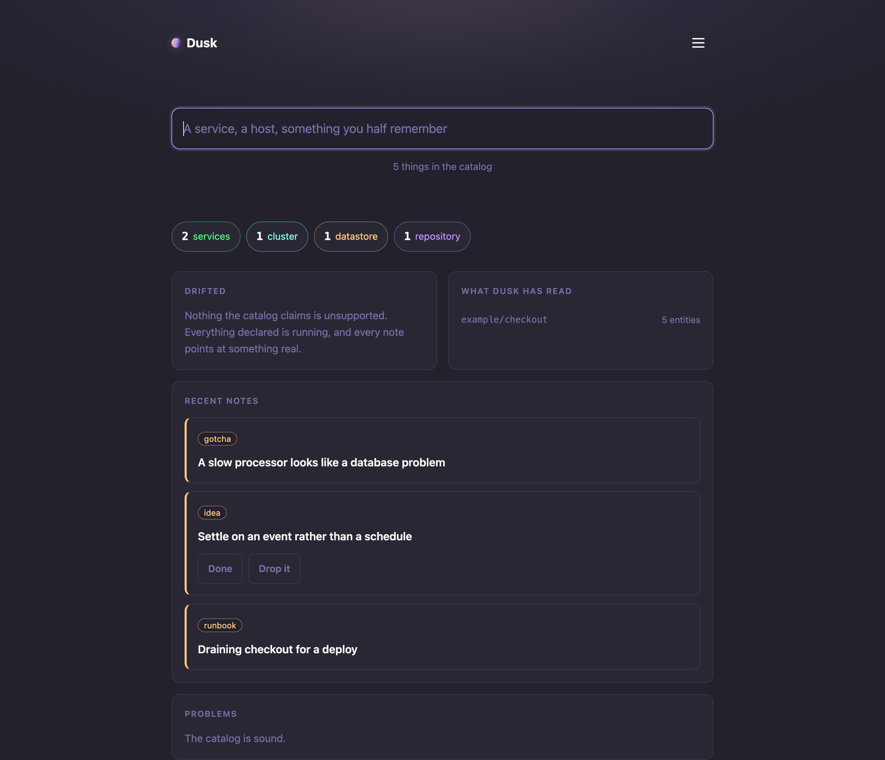
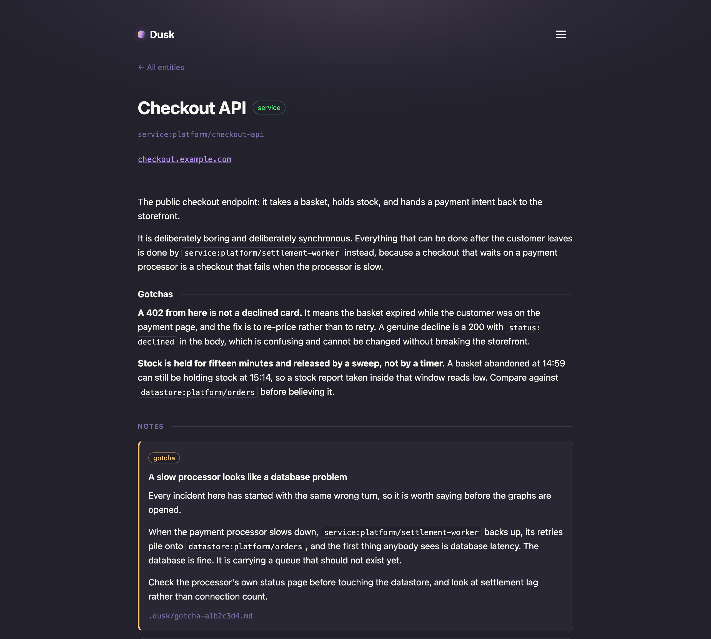
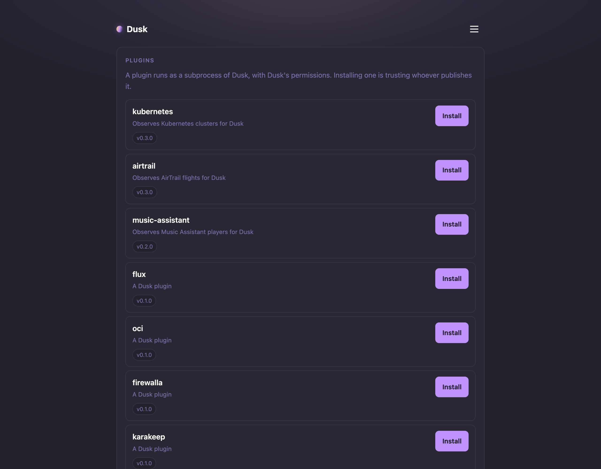

# Dusk

**The internal developer platform for homelabbers.**

Dusk gives one person and their agents a shared place to understand and operate a homelab.
It is self-hosted, Git-backed, and built around the assumption that one trusted operator owns the whole thing.

The catalog says what exists, where it runs, and what depends on it.
Notes keep the gotchas, runbooks, decisions, and half-remembered details beside the things they describe.
Plugin actions let a human or an agent inspect and change those systems without hiding what ran.

Backstage is the useful comparison, not the roadmap.
Backstage gives platform teams a portal; Dusk gives a homelabber and their agents a smaller place to remember how the estate works and safely do things to it.
There is no enterprise permission maze, org chart, software factory, or compliance layer to administer.

Every knowledge tool dies the same way: the curation burden falls on a human who has better things to do.
Dusk assumes the agents doing the work can also do the documenting, so the catalog updates as a byproduct of the work rather than as a chore after it.

> Status: running in production against a real homelab, with plugins observing Kubernetes, Flux, container hosts, OCI registries, the network, and Home Assistant. [DESIGN.md](DESIGN.md) is the architecture, [docs/ecosystem.md](docs/ecosystem.md) is what Dusk integrates with, and [docs/status.md](docs/status.md) is what is built and what is not.



This is the catalog: the homepage is declared in `.dusk/home.md`, and every block is a query ([docs/pages.md](docs/pages.md)).

## Quickstart

Run the published container with the included Compose file, register the GitHub App in the browser, and install it on the repositories that make up the homelab.

```zsh
git clone https://github.com/NerdsWhoFish/dusk.git
cd dusk
export DUSK_PRIVATE_HOST=https://dusk.example.com
export DUSK_ENCRYPTION_KEY="$(docker run --rm ghcr.io/nerdswhofish/dusk:latest genkey)"
export DUSK_MCP_TOKEN="$(docker run --rm ghcr.io/nerdswhofish/dusk:latest genkey)"
docker compose --file deploy/compose.yaml up --detach
```

Open `$DUSK_PRIVATE_HOST/setup`.
The [getting-started guide](docs/getting-started.md) covers the GitHub App, Helm, network requirements, configuration, backup, restore, upgrade, and rollback.
[`examples/starter/dusk.md`](examples/starter/dusk.md) produces the first catalog result; [`examples/homelab`](examples/homelab) is a realistic multi-entity starting point.



This is the memory: an entity is one markdown file in the repository that owns it, and the notes an operator or agent attaches to it appear where they will need them.

## What makes it different

- You never fork it. Run the binary, point it at a repo, and it reconciles. No Node monorepo to own and no upgrade merge conflicts.
- Git is the source of truth. Entities are markdown with frontmatter in the repos they describe. Agents read files directly, and agent writes are file edits, so review and history come for free.
- Pull requests are first class. Any open PR renders as the catalog as it would be after merge, with a semantic diff of what actually changed.
- Plugins are subprocesses. A plugin can be a shell script that prints JSON. Write one in any language.
- Search fuses exact identity and local FTS5, can add local OSS semantic retrieval, and offers an optional grounded AI mode that cites the catalog entities and notes it used.

Together, the catalog, memory, and actions are the platform.



A plugin is installed from a release in an allowlisted organisation, with its checksum verified before anything runs.
That account list is the code trust boundary, but a plugin does not inherit Dusk's deployment environment: it receives only its declared configuration, its private socket credential, and a small runtime allowlist ([ADR-0020](adr/0020-plugin-ui.md), [ADR-0042](adr/0042-installing-plugins.md)).

## Documentation

- [DESIGN.md](DESIGN.md) covers the architecture, the decisions, and the open questions.
- [adr/](adr/) holds the decision records, including the alternatives that were rejected and why.
- [docs/dusk-md.md](docs/dusk-md.md) is the reference for the `dusk.md` file a repository uses to join the catalog.
- [docs/getting-started.md](docs/getting-started.md) covers first install, GitHub App setup, containers, Helm, networking, backup, restore, upgrade, and rollback.
- [docs/reconcile.md](docs/reconcile.md) covers turning a repository into the graph, and `dusk validate` for checking a checkout locally.
- [docs/mcp.md](docs/mcp.md) is the agent-facing surface: the tools, how to connect, and what is not built yet.
- [docs/controller.md](docs/controller.md) covers what keeps the catalog current: discovery, the account allowlist, webhooks, the poll floor, and the API budget.
- [docs/storage.md](docs/storage.md) covers the materialized graph: how it is keyed, what it stores, and how search works.
- [docs/ingest.md](docs/ingest.md) covers the half of the catalog nobody types: what an ingester promises, why a failure never deletes, and why every one of them is a plugin.
- [docs/ecosystem.md](docs/ecosystem.md) names the released homelab integrations, the questions each answers, and the bar for adding another one.
- [docs/kinds.md](docs/kinds.md) is the vocabulary: how kinds are counted rather than configured, what minting one changes, and why a near match warns instead of refusing.
- [docs/pages.md](docs/pages.md) is the homepage: the `.dusk/home.md` a config repository declares, every block type, and the query grammar behind them.
- [docs/plugins.md](docs/plugins.md) is for plugin authors: what an action's parameter schema may contain, which shape becomes which control, and what a form refuses before the plugin sees it.
- [docs/observability.md](docs/observability.md) covers OTLP export, collector configuration, trace propagation, and log correlation.
- [docs/ai-search.md](docs/ai-search.md) covers the optional OpenAI-compatible question mode, what leaves Dusk, model selection, and failure behavior.
- [docs/packages.md](docs/packages.md) maps every package to its job, and the rules for adding one. Read it before writing anything new.
- [docs/philosophy.md](docs/philosophy.md) is the posture behind the design.
- [docs/status.md](docs/status.md) tracks what is built and what is not.

## License

Apache 2.0. Contributions are accepted under the DCO. See [ADR-0003](adr/0003-license.md).
