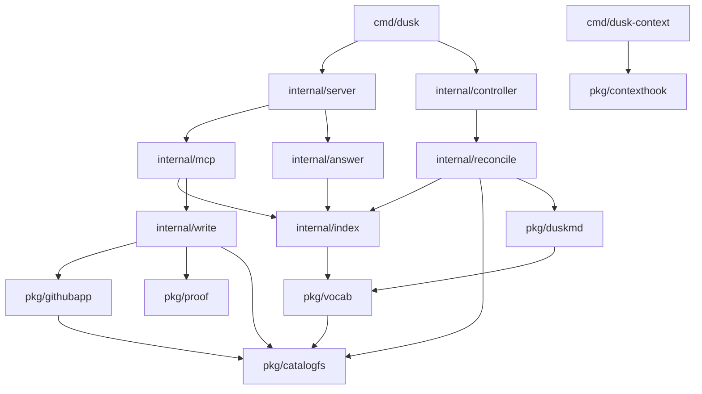

# Packages

What each package is for, what it is deliberately not for, and the rules for adding one.

Read this before writing something new.
The most expensive mistake in this codebase is a second implementation of something that already exists, because nothing fails: the two copies just drift until they disagree, and then a local check passes while production reads it wrong.
That has already happened here twice, which is why this file exists.

## The rule that matters most

**Assume what you need already exists, and go look.**

If you are about to write a matcher, a parser, a path rule, a client, or a "small helper", find the package below whose job it is and put it there, or use what is already in it.
If nothing owns it, that is a signal worth acting on: either it belongs in an existing package whose scope you should widen deliberately, or it is a new package and the rules at the bottom apply.

The question to ask is never "where is it convenient to put this".
It is **"whose job is this?"**

## Layout

`pkg/` is a promise, `internal/` is a fence, `cmd/` is thin ([ADR-0017](../adr/0017-engineering-policy.md)).

Dependencies run one way: `cmd` → `internal` → `pkg`.
A `pkg/` package must never import an `internal/` one, and the compiler will not stop you noticing this too late, because `internal/` is only invisible from *outside* the module.

## `pkg/`: reusable, no Dusk deployment assumed

| Package | Its job | Not its job |
| --- | --- | --- |
| `catalogfs` | The file semantics of a catalog repository: what counts as a catalog file, which paths are Dusk's own configuration rather than content, how `include` patterns match **and where they place a new file**, and the in-memory tree a reconcile reads from | Fetching anything. It has no network, no disk, and no idea where the files came from |
| `contexthook` | The client side of context injection: asking a Dusk what an agent should know before it starts, in the shape a session-start hook injects ([ADR-0014](../adr/0014-agent-context-injection.md)) | Deciding what an agent is told. `dusk_context` ranks the answer and spends its budget server side, and what it returns is passed through unchanged |
| `duskmd` | Parsing and formatting every catalog file: `dusk.md`, notes, and the kind vocabulary, with errors that name file, line, field and expectation | Deciding *which* files to parse, or what a graph means. It sees one file at a time |
| `githubapp` | Everything that talks to GitHub: the App manifest flow, installation tokens, tarball downloads, commits, and the API rate-limit budget | Interpreting what it fetched. It returns a `catalogfs.Tree`, never a parsed entity |
| `proof` | The read-before-write gate: issuing tokens for what a read returned, refusing a write whose token is missing, stale, or never saw the thing, and rendering the call that recovers from each | Performing the write, or knowing what an entity is. Which read recovers a given write is named by the caller as a `proof.Subject`, because nothing derives it from a ref |
| `secret` | A string type that refuses to render itself in logs, errors, or `%v` | Encrypting anything |
| `textdiff` | The unified diff between two versions of one file, so a change Dusk may not commit comes back as something `git apply` takes ([ADR-0052](../adr/0052-a-write-that-cannot-land.md)) | Comparing catalogs. The difference between two versions of the *graph* is semantic and belongs to `index` |
| `vault` | Envelope encryption for credentials at rest | Deciding what is worth encrypting, or where it is stored |
| `vocab` | The catalog's vocabulary of kinds: the roles a kind can carry, what each one ranks, and which existing kind a new name is probably a misspelling of | Counting what is in use, which is the index's job, and parsing the file that mints one, which is `duskmd`'s |

## `internal/`: this deployment's logic

| Package | Its job | Not its job |
| --- | --- | --- |
| `access` | Who may read the catalog, in both credentials: a bearer token for agents and a session cookie for browsers | Deciding *what* a reader may see. It answers yes or no for the whole catalog ([ADR-0012](../adr/0012-viewing-auth.md)) |
| `answer` | Grounding optional AI questions in a bounded viewer-visible catalog slice and calling the configured OpenAI-compatible endpoint | General chat, model discovery, conversation history, tools, or writes. Its prompts and retrieval rules are specific to Dusk and therefore fenced under `internal/` ([0081](../adr/0081-ai-search-is-grounded-and-opt-in.md)) |
| `config` | Reading and validating boot configuration, reporting every problem at once | Reaching the network to check whether a configured thing exists. Shape only; existence is checked at use |
| `events` | The record of what an action invocation did, kept in a bounded buffer and logged | Persisting it. Events are never written to the index, which is disposable by contract and cannot rebuild them ([ADR-0015](../adr/0015-plugin-actions-and-events.md)) |
| `index` | The materialized graph in SQLite, partitioned by `(repository, git ref)`, and every query over it: search, drift, integrity, visibility, which notes nearly say the same thing, and the semantic diff between two refs | Deciding what to store. It is disposable by contract and rebuilt from git |
| `ingest` | Observing infrastructure and storing what it found: the `Ingester` interface, the completeness contract, the scheduler and the never-delete rule. It contains no ingester, because every source is a plugin ([ADR-0040](../adr/0040-core-and-plugins.md)) | Deciding what an observation means. Plugins normalize at the edge and this stores; comparing it to what was declared is the index's job |
| `page` | Turning a portal page's declared blocks into resolved queries ([ADR-0035](../adr/0035-blocks-resolve-server-side.md)). It imports `plugin` for the shape of a contribution, because a `view` block resolves to one and a second declaration of that shape would drift | Rendering. A block carries its result; how that looks is the browser's decision. Nor knowing which plugins are running, which is why `server` fills a view block's mount in |
| `reconcile` | Turning a repository at a ref into a graph: resolving a commit, expanding includes, parsing what they reach | Talking to GitHub, and matching paths. A `Source` produces a tree; `catalogfs` matches over it |
| `controller` | Keeping the catalog in step with GitHub: the sweep, the poll floor, webhook-driven reconciles, retries, and the API budget | Parsing, storing, or serving. It decides *when* to reconcile, not how |
| `write` | Turning an agent's declaration, relation or note into a commit, routing it to the file that owns it, and returning the diff instead where Dusk was granted no commit ([ADR-0052](../adr/0052-a-write-that-cannot-land.md)) | Deciding whether the agent may write. That is `proof`. A relation is routed to the file of the entity it points **from**, and nothing here can write one the other way ([ADR-0026](../adr/0026-dusk-md-schema.md)) |
| `mcp` | The agent surface: tools, markdown answers, and the proof token appended to every read | Any catalog logic. Every tool is a thin call into `index` or `write` |
| `plugin` | Everything about a plugin as a running thing: the marketplace, install and update, the process and its socket, keeping that process alive and reporting when it will not stay up, what it declares, and its configuration on disk including the sealed half | Scheduling it. A running plugin is an ordinary `ingest.Ingester` and the rotation is `ingest`'s. Keeping the *process* up is here; deciding when it is asked to observe, and backing that off, is `ingest`'s ([ADR-0039](../adr/0039-one-plugin-transport.md), [ADR-0040](../adr/0040-core-and-plugins.md), [ADR-0055](../adr/0055-supervising-plugin-processes.md)) |
| `server` | HTTP: onboarding, health, webhooks, and mounting the agent surface | Doing the work behind a request. A handler validates, dispatches, and answers |
| `store` | Persisting the GitHub App credentials, encrypted | Choosing the encryption. That is `vault`. Nor a plugin's credentials: those live beside that plugin's record so uninstalling takes them with it, which is `plugin`'s job |
| `telemetry` | The process-wide OpenTelemetry provider, HTTP instrumentation, propagation, and trace correlation for structured logs | Choosing the backend, holding its credentials, or becoming a shared instrumentation library for other repositories ([0080](../adr/0080-runtime-telemetry-uses-explicit-opentelemetry-sdks.md)) |

`web/` is the React UI plus the `go:embed` that carries its build into the binary.
It sits at the repository root rather than under `internal/` because the embed directive cannot reach outside its own directory, and copying build output into a Go package is a step that gets forgotten and ships a stale UI.

The UI is an ordinary client of the HTTP API with no privileged path, so anything it renders is fetchable with curl.
Styling is CSS custom properties rather than a utility framework, because those are the only thing that crosses into a plugin's shadow DOM and therefore the theming contract [ADR-0020](../adr/0020-plugin-ui.md)'s Web Components depend on.

## Where things commonly want to go, and where they belong

These are the calls that have actually been got wrong.

| You are writing | It goes in |
| --- | --- |
| A path or glob rule | `catalogfs`. Never in a reader, and never in a writer: `Place` is there so a pattern that matches on read produces a path on create |
| "Is this file worth reading" | `catalogfs.IsCatalogFile`. There is exactly one answer to this |
| "Is this file Dusk's own configuration" | `catalogfs.IsReserved`, which is also where the path constant lives |
| Anything that parses frontmatter | `duskmd` |
| A rule about what a kind means, or whether two names are the same kind | `vocab` |
| A new GitHub endpoint call | `githubapp` |
| Interpretation of a GitHub error | `githubapp`, as a typed error the caller can match with `errors.Is` |
| A new way to read a repository | A `reconcile.Source`. Its only job is producing a `catalogfs.Tree` |
| A new query over the catalog | `index`, as a method. Not assembled from several queries in `mcp` |
| A rule about when to reconcile | `controller` |
| A rule about whether a plugin's process should be up | `plugin`. A rule about when it is asked to observe is `ingest` ([ADR-0055](../adr/0055-supervising-plugin-processes.md)) |
| A rule about whether a write is allowed | `proof` |
| A new agent tool | `mcp`, as a thin call into `index` or `write` |
| A rule about who may read | `access`. Both credentials, one policy, so a deployment cannot lock one surface and open another |
| A rule about *what* a reader may see | `index`, as an `index.Visibility` the query takes. A list may be narrowed where it is rendered; a count or a comparison has to be filtered where it is computed ([ADR-0051](../adr/0051-a-count-is-of-what-the-viewer-can-see.md)) |
| A new source of entities | A plugin, in its own `dusk-plugin-*` repository. Never in tree: core carries no ingester ([ADR-0040](../adr/0040-core-and-plugins.md)) |
| A new thing a portal page can show | `page`, as a block type. A block is a query, not a widget |
| Anything the UI renders | An API endpoint first. The UI has no privileged path to the index |

## Adding a package

Adding one is cheap; adding the *wrong* one is not, because it splits a concept in half and both halves start growing.

**Add a package when it has a job you can name in one sentence without using "and".**
`catalogfs` earned its place as "the file semantics of a catalog repository". A package that needs "and" in its description is two packages, or it is a piece of one that already exists.

Before adding one, in order:

1. **Find the package whose job this already is.** Most new code is a method on something that exists.
2. **If nothing owns it, ask whether an existing package's scope should widen.** Widening a scope deliberately is better than a new package that will be missed by the next person searching.
3. **Only then add one.** `pkg/` if another program could plausibly use it, `internal/` if it genuinely should not be imported and you can say why. "I have not thought about reuse" is not a reason for `internal/`.

Rules that hold whatever you decide:

- **No `util`, `common`, `helpers`, or `misc`.** Those are where code goes to avoid being named, and they become the place nobody searches.
- **A package name says what it provides**, not what layer it sits in.
- **One concept, one owner.** If two packages could each plausibly own a rule, one of them must, and the other imports it. Two plausible owners is how the glob divergence happened.
- **A `pkg/` package cannot import `internal/`.** If it needs to, it is not reusable and belongs in `internal/`.
- **A second repository depending on a `pkg/` package promotes it to its own module** ([ADR-0017](../adr/0017-engineering-policy.md)), because importing it otherwise drags the whole `dusk` module along.
- **Update this file in the same change.** A stale map sends the next person to reimplement something.

## Deleting one

A package whose job moved elsewhere is deleted, not left as a thin wrapper.

`githubapp` kept a per-file reader after [ADR-0032](../adr/0032-tarball-reads.md) replaced it, and because it still satisfied the `Source` interface it stayed a live second implementation of include matching, silently wrong, for as long as it existed.
Dead code that still compiles against a live interface is not dead.
